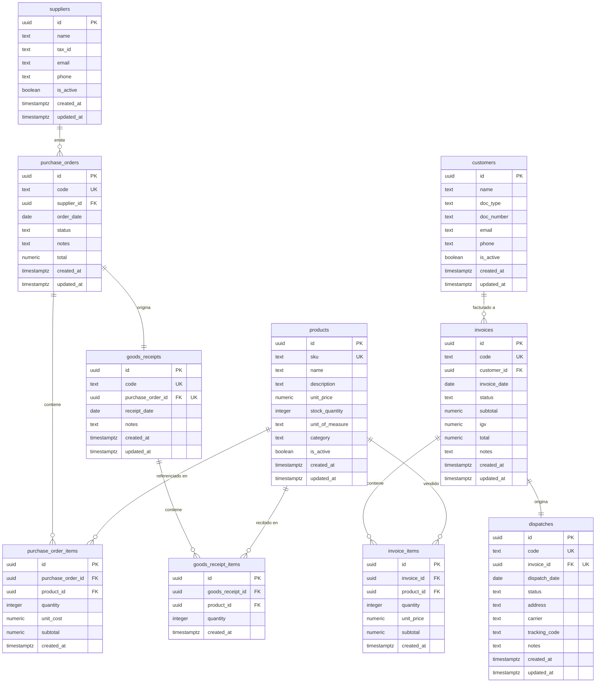

# Arquitectura del Sistema — Desafío Web

## Resumen del Sistema

**Desafío Web** es un sistema de gestión comercial que cubre el ciclo completo desde la compra hasta la entrega al cliente. El flujo de negocio sigue esta secuencia:

```
Orden de Compra → Ingreso de Mercadería → Facturación → Despacho
   (pending)          (stock +)           (stock −, IGV 18%)   (entrega)
```

1. **Orden de Compra** (`purchase_orders`): se registra la intención de compra a un proveedor con sus líneas de detalle. Estado inicial: `pending`.
2. **Ingreso de Mercadería** (`goods_receipts`): al recepcionar la OC, el stock de cada producto se incrementa atómicamente y la OC pasa a `received`. Una OC solo puede recibirse una vez (UNIQUE constraint en `goods_receipts.purchase_order_id`).
3. **Facturación** (`invoices`): al emitir una factura se valida stock disponible con `SELECT ... FOR UPDATE` para evitar sobreventas, se descuenta el stock, y se calculan subtotal, IGV (18 %) y total en una sola transacción atómica.
4. **Despacho** (`dispatches`): la factura emitida origina un despacho con ciclo de vida `pending → in_transit → delivered`. Avance de estado con semántica compare-and-swap para evitar carreras.

Maestros de soporte: **Productos** (con soft-delete), **Proveedores** y **Clientes**.

---

## Stack Tecnológico

| Tecnología | Versión | Justificación |
|---|---|---|
| Next.js (App Router) | 16.2.9 | SSR nativo, Server Actions y Server Components eliminan una capa de API; el modelo mental es lineal y directo para un desafío de 48 h. |
| React | 19.2.4 | Requerido por Next.js 16; `useActionState` nativo simplifica formularios con Server Actions. |
| TypeScript (strict) | ^5 | Tipado estricto en toda la base de código; interfaces derivadas de Zod garantizan consistencia entre schema y runtime. |
| Supabase (PostgreSQL + Auth + RLS) | @supabase/supabase-js ^2 | BaaS completo: base de datos relacional, autenticación JWT y Row-Level Security en una sola plataforma; elimina la necesidad de gestionar un servidor propio. |
| @supabase/ssr | ^0.12 | Manejo correcto de cookies en SSR para Next.js; expone `createServerClient` y el helper `updateSession`. |
| Tailwind CSS v4 | ^4 | Utilidades CSS sin configuración adicional; velocidad de prototipado alta. |
| shadcn/ui | ^4.11 | Componentes accesibles sobre Radix UI; se copian al proyecto y se modifican libremente, sin dependencia de runtime. |
| react-hook-form + Zod | ^7 / ^4 | Validación declarativa en cliente y server; un solo schema es fuente de verdad para tipos e inputs. |
| TanStack Query | ^5.101 | Caché y revalidación del lado del cliente para listados dinámicos. |
| Vercel | — | Plataforma nativa de Next.js; zero-config para App Router y Server Actions. |

---

## Arquitectura Modular por Features

```
src/
├── app/                        # Rutas Next.js (App Router)
│   ├── (app)/                  # Grupo de rutas protegidas
│   │   ├── layout.tsx          # Capa 2 de autenticación (getUser server-side)
│   │   ├── products/           # Página de Productos
│   │   ├── suppliers/          # Página de Proveedores
│   │   ├── purchase-orders/    # Página de Órdenes de Compra
│   │   ├── goods-receipts/     # Página de Ingreso de Mercadería
│   │   ├── customers/          # Página de Clientes
│   │   ├── invoices/           # Página de Facturación
│   │   └── dispatches/         # Página de Despacho
│   └── login/                  # Ruta pública
├── features/                   # Módulos de negocio
│   └── <módulo>/
│       ├── components/         # Componentes React del módulo
│       ├── actions.ts          # Server Actions (mutaciones)
│       ├── schema.ts           # Schemas Zod (validación)
│       ├── queries.ts          # Lectura de datos (Server Components)
│       └── types.ts            # Tipos TypeScript del módulo
├── components/ui/              # Primitivos shadcn/ui (no editar)
└── lib/supabase/
    ├── client.ts               # Cliente browser (createBrowserClient)
    ├── server.ts               # Cliente servidor (createServerClient + cookies async)
    └── middleware.ts           # Helper updateSession (refresco de sesión)
```

### Separación de responsabilidades

- **`queries.ts`**: solo lectura; llamadas directas a Supabase desde Server Components. Sin efectos secundarios.
- **`actions.ts`**: solo escritura; valida con Zod, llama a Supabase o RPC, revalida caché con `revalidatePath`. Marcadas `'use server'`.
- **`schema.ts`**: fuente de verdad de validación; compartida entre cliente (formulario) y servidor (acción).
- **`types.ts`**: tipos TypeScript derivados de los schemas o definidos manualmente; nunca importa lógica de negocio.
- **`components/`**: solo presentación y orchestration de UI; delegan la lógica a las acciones.

### Por qué NO arquitectura hexagonal

Un desafío de 48 horas no justifica la capa de puertos/adaptadores, interfaces de repositorio y casos de uso explícitos. La arquitectura hexagonal es correcta para sistemas de producción a largo plazo, pero agrega boilerplate que reduce la velocidad aquí. El enfoque feature-modular elegido permite refactorizar hacia hexagonal progresivamente: `queries.ts` se convierte en un repositorio y `actions.ts` en un caso de uso sin reescribir los componentes.

---

## Modelo de Datos



---

## Decisiones Técnicas Clave

### Seguridad en 3 capas (defensa en profundidad)

| Capa | Dónde | Qué hace |
|---|---|---|
| 1 — Middleware | `src/proxy.ts` → `updateSession()` | Intercepta cada request HTTP; refresca el token de sesión y redirige a `/login` si no hay usuario autenticado. |
| 2 — Layout guard | `src/app/(app)/layout.tsx` | Llama a `supabase.auth.getUser()` server-side antes de renderizar cualquier HTML protegido. Cubre desvíos del matcher del middleware y condiciones TOCTOU. |
| 3 — RLS en Postgres | Todas las tablas | Políticas `FOR SELECT / INSERT / UPDATE TO authenticated` aseguran que ninguna consulta directa a la API PostgREST omita la autenticación, incluso si las capas anteriores fallaran. |

Esta combinación sigue la guía oficial de `@supabase/ssr`: el middleware refresca las cookies pero no es suficiente por sí solo; el `getUser()` en el servidor garantiza que el token sea válido contra el servidor de Auth de Supabase.

### Operaciones atómicas vía RPC de Postgres

PostgREST (la API REST de Supabase) no soporta transacciones multi-statement entre llamadas separadas. Si una operación que escribe en múltiples tablas falla a la mitad, los datos quedan en estado inconsistente. Para evitar esto, las operaciones complejas se implementan como funciones PL/pgSQL con `SECURITY INVOKER`:

| RPC | Qué hace atómicamente |
|---|---|
| `create_purchase_order(p_supplier_id, p_order_date, p_notes, p_items)` | Genera código OC-YYYY-NNNN, calcula total, inserta cabecera e ítems. |
| `receive_purchase_order(p_purchase_order_id, p_notes)` | Valida estado `pending` con `FOR UPDATE`, genera código ING-YYYY-NNNN, inserta recepción e ítems, incrementa stock, marca OC como `received`. |
| `create_invoice(p_customer_id, p_invoice_date, p_notes, p_items)` | Valida stock con `FOR UPDATE` (anti-sobreventa), calcula IGV 18 %, genera código F-YYYY-NNNN, inserta factura e ítems, decrementa stock. |

`SECURITY INVOKER` significa que la función hereda los permisos del usuario que la llama (el usuario autenticado de Supabase), por lo que las políticas RLS siguen aplicándose dentro de la función.

### Cuándo NO usar RPC: Despacho

El módulo de Despacho opera sobre una sola tabla (`dispatches`) con operaciones de una sola fila. No hay riesgo de inconsistencia multi-tabla, por lo que usa Server Actions con llamadas DML directas a Supabase. El avance de estado usa semántica compare-and-swap (`.eq('status', current)`) para detectar carreras sin necesidad de `FOR UPDATE`.

### Control de stock

- **Ingreso suma**: `receive_purchase_order` hace `stock_quantity = stock_quantity + poi.quantity` para cada producto de la OC.
- **Factura resta**: `create_invoice` primero itera todos los ítems con `SELECT ... FOR UPDATE` para bloquear las filas y validar disponibilidad (`INSUFFICIENT_STOCK`), y solo entonces descuenta. El bloqueo previene la sobreventa bajo carga concurrente.
- **Soft-delete de productos**: `is_active = false` en lugar de `DELETE`. Esto preserva el historial en `purchase_order_items`, `goods_receipt_items` e `invoice_items` sin violar integridad referencial.

### IGV 18 %

Calculado en la función `create_invoice`: `igv = round(subtotal * 0.18, 2)`. Las columnas `subtotal`, `igv` y `total` se persisten en `invoices` para no recalcular en tiempo de consulta y para mantener un registro exacto del impuesto en el momento de la emisión.

### Server Actions para mutaciones, Server Components para lecturas

Las mutaciones van por Server Actions (`actions.ts`) que se ejecutan en el servidor, validan con Zod y llaman a Supabase. Las lecturas para el render inicial van en Server Components (`queries.ts`) con llamadas directas al cliente de servidor de Supabase. TanStack Query se usa para actualizaciones de datos en el lado del cliente cuando el usuario interactúa sin navegar.

---

## Metodología: Spec-Driven Development (SDD)

Cada módulo siguió el ciclo: **exploración → propuesta → especificación → diseño → tareas → implementación → verificación adversarial**. Los artefactos se guardaron en `openspec/` y en memoria persistente (Engram). Los commits se organizaron como unidades de trabajo revisables (un commit por tarea significativa). Este enfoque aseguró que las decisiones de diseño estuvieran registradas antes de escribir código, facilitando la revisión posterior.

---

## Supuestos Documentados

| Supuesto | Justificación |
|---|---|
| Proveedores y Clientes como maestros mínimos (name, tax_id/doc_number, email, phone, is_active) | El brief no especificaba su estructura; se modelaron con los campos mínimos necesarios para la operación. |
| Recepción completa de OC (no parcial) | Simplificación de 48 h; una recepción toma todos los ítems de la OC. |
| Factura no anulable con restock | La columna `status IN ('issued', 'cancelled')` existe en el schema, pero la lógica de anulación con devolución de stock no se implementó en esta iteración. |
| Un despacho por factura | Enforceado por `UNIQUE(invoice_id)` en `dispatches`. |
| Usuario administrador único | No hay roles diferenciados (admin/vendedor/almacenero); cualquier usuario autenticado puede operar todos los módulos. |
