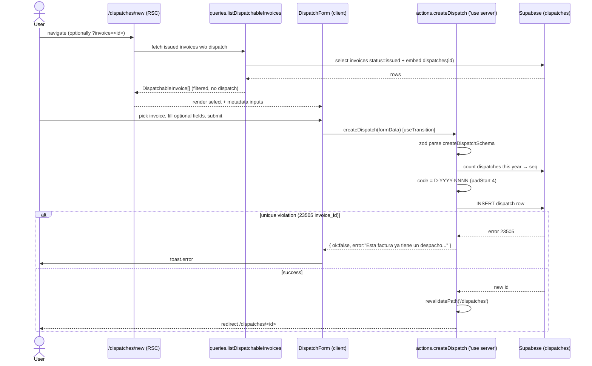
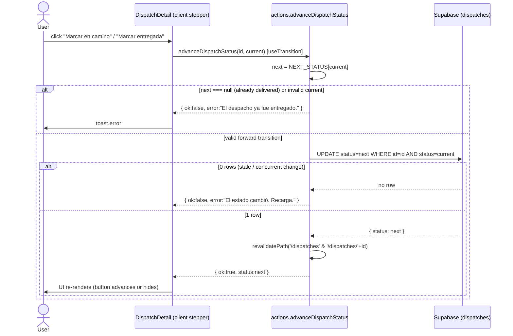

# Design: Despacho (Dispatch) — Module 6

## Architecture Overview

Dispatch is the FINAL module of the order-to-delivery flow
(`compra → ingreso → venta → despacho`). It is the SMALLEST mutation module in
the system: a single-table header with a status field, no line-item math, no
multi-table atomic write.

It mirrors the established **feature-modular + Server Actions + RLS** architecture
already used by `goods-receipts` and `invoices`, with ONE deliberate
simplification: **no RPC**. Modules 3/4/5 needed `SECURITY INVOKER` plpgsql
functions because they performed multi-table atomic mutations (header + items +
stock movement). Dispatch does not. Creating a dispatch is a single `INSERT`;
advancing status is a single `UPDATE`. Therefore plain Server Actions are the
correct boundary — adding an RPC here would be ceremony without payoff.

### Layering (unchanged from existing modules)

```
Route (Server Component, (app) guard)
  └─ loads data via queries.ts (read)         ── Supabase server client
  └─ renders Client Component (form / detail)
       └─ calls Server Action (actions.ts)     ── 'use server'
            └─ zod validate → Supabase mutate → revalidatePath → redirect
```

- **Read path**: route Server Components call `queries.ts` (PostgREST joins).
- **Write path**: Client Components call Server Actions in `actions.ts`.
- **Validation**: zod schemas in `schema.ts`, parsed inside the action.
- **Security**: RLS `authenticated` on `dispatches`; `(app)` layout guard +
  middleware are the two existing auth layers (unchanged).

### Boundary decision: route naming

The proposal text said `/dispatch`, but the established convention is **plural,
kebab-case** resource routes (`/purchase-orders`, `/goods-receipts`,
`/invoices`, `/customers`). To stay consistent we use **`/dispatches`** and the
feature dir **`src/features/dispatch/`** (singular feature name, plural route —
same split invoices uses: feature `invoices` is already plural so no contrast,
but `goods-receipts` dir == route). Resolved: route segment `dispatches`,
feature module `dispatch`. Nav label and dashboard card: **"Despacho"**.

---

## Data Model

### Migration: `supabase/migrations/0005_dispatch.sql`

One additive table. Reuses `set_updated_at()` (Module 1) and the established RLS
policy naming. No changes to existing tables → trivially reversible.

```sql
-- ============================================================
-- Migration: 0005_dispatch
-- Description: dispatches table (delivery header per invoice),
--              RLS policies, updated_at trigger. No RPC, no seed.
-- Apply via: Supabase SQL editor or `supabase migration up`
-- ============================================================

-- ============================================================
-- 1. DISPATCHES TABLE
-- ============================================================
CREATE TABLE IF NOT EXISTS public.dispatches (
  id            uuid        PRIMARY KEY DEFAULT gen_random_uuid(),
  code          text        NOT NULL,
  invoice_id    uuid        NOT NULL REFERENCES public.invoices(id),
  dispatch_date date        NOT NULL DEFAULT current_date,
  status        text        NOT NULL DEFAULT 'pending'
                            CHECK (status IN ('pending', 'in_transit', 'delivered')),
  address       text,
  carrier       text,
  tracking_code text,
  notes         text,
  created_at    timestamptz NOT NULL DEFAULT now(),
  updated_at    timestamptz NOT NULL DEFAULT now(),
  CONSTRAINT dispatches_code_key       UNIQUE (code),
  CONSTRAINT dispatches_invoice_id_key UNIQUE (invoice_id)
);

-- One dispatch per invoice → UNIQUE(invoice_id) is the hard guarantee.
-- UNIQUE(code) is the backstop for the per-year sequence race (see ADR-002).

-- updated_at trigger reuses set_updated_at() from 0001_products
CREATE OR REPLACE TRIGGER dispatches_set_updated_at
  BEFORE UPDATE ON public.dispatches
  FOR EACH ROW
  EXECUTE FUNCTION public.set_updated_at();

-- ============================================================
-- 2. RLS
-- ============================================================
ALTER TABLE public.dispatches ENABLE ROW LEVEL SECURITY;

CREATE POLICY dispatches_select_authenticated
  ON public.dispatches FOR SELECT TO authenticated USING (true);

CREATE POLICY dispatches_insert_authenticated
  ON public.dispatches FOR INSERT TO authenticated WITH CHECK (true);

CREATE POLICY dispatches_update_authenticated
  ON public.dispatches FOR UPDATE TO authenticated
  USING (true) WITH CHECK (true);
```

Notes:
- No `DELETE` policy — dispatch has no cancellation/reversal in scope.
- No seed — dispatches are derived from real issued invoices at runtime.
- `invoice_id` keeps a plain FK (not `ON DELETE CASCADE`): invoices are never
  deleted in this domain (only `cancelled`), so cascade is unnecessary.

### Column rationale

| Column | Why |
|--------|-----|
| `code` UNIQUE | Human-facing `D-YYYY-NNNN`, generated in the action |
| `invoice_id` UNIQUE NOT NULL | Enforces ONE dispatch per invoice at DB level |
| `dispatch_date` default `current_date` | Matches invoices/receipts pattern |
| `status` CHECK | Lifecycle gate; forward-only enforced in the action |
| `address/carrier/tracking_code/notes` | Optional logistics metadata |

---

## Feature Module: `src/features/dispatch/`

Mirrors `goods-receipts` file shape exactly.

```
src/features/dispatch/
  types.ts          # Dispatch row + joined list/detail views
  schema.ts         # createDispatchSchema (+ status helpers)
  queries.ts        # listDispatches, getDispatch, listDispatchableInvoices
  actions.ts        # createDispatch, advanceDispatchStatus
  components/
    DispatchForm.tsx        # client: select dispatchable invoice + metadata
    DispatchesTable.tsx     # list table
    DispatchDetail.tsx      # header + invoice + items + status stepper
```

### `types.ts`

```ts
/** Status union — mirrors the DB CHECK constraint. */
export type DispatchStatus = 'pending' | 'in_transit' | 'delivered'

/** Embedded customer (via invoice). */
export type CustomerRef = { name: string }

/** Embedded invoice shape for list/detail joins. */
export type InvoiceRef = {
  code: string
  total: number
  customers: CustomerRef
}

/** Embedded product (via invoice_items). */
export type ProductRef = { name: string }

/** Invoice line item embedded in the detail view. */
export type DispatchInvoiceItem = {
  id: string
  product_id: string
  quantity: number
  unit_price: number
  subtotal: number
  products: ProductRef
}

/** Dispatch header row (table columns 1:1). */
export type Dispatch = {
  id: string
  code: string
  invoice_id: string
  dispatch_date: string
  status: DispatchStatus
  address: string | null
  carrier: string | null
  tracking_code: string | null
  notes: string | null
  created_at: string
  updated_at: string
}

/** List row — dispatch + joined invoice + customer. */
export type DispatchListRow = Dispatch & {
  invoices: InvoiceRef
}

/** Detail — dispatch + invoice + customer + invoice_items + products. */
export type DispatchDetail = Dispatch & {
  invoices: InvoiceRef & { invoice_items: DispatchInvoiceItem[] }
}

/** An issued invoice with NO dispatch yet — feeds the create form. */
export type DispatchableInvoice = {
  id: string
  code: string
  total: number
  customer_name: string
}
```

### `schema.ts`

```ts
import { z } from 'zod'

export const createDispatchSchema = z.object({
  invoice_id: z
    .string()
    .uuid({ message: 'Debe seleccionar una factura válida.' }),
  address: z.string().trim().max(300).optional(),
  carrier: z.string().trim().max(120).optional(),
  tracking_code: z.string().trim().max(120).optional(),
  notes: z.string().trim().max(500).optional(),
})

export type CreateDispatchInput = z.infer<typeof createDispatchSchema>

/** Forward-only lifecycle. delivered is terminal. */
export const NEXT_STATUS: Record<
  DispatchStatus,
  DispatchStatus | null
> = {
  pending: 'in_transit',
  in_transit: 'delivered',
  delivered: null,
}
```

`advanceDispatchStatus` takes `(id, current)` args directly — no FormData/zod
needed; `current` is validated against `NEXT_STATUS` server-side (the client
hint is NOT trusted; see ADR-003).

### `queries.ts`

```ts
// listDispatches — list view, newest first
supabase
  .from('dispatches')
  .select('*, invoices(code, total, customers(name))')
  .order('dispatch_date', { ascending: false })
  .order('created_at', { ascending: false })

// getDispatch(id) — detail with invoice + customer + items + products
supabase
  .from('dispatches')
  .select(
    '*, invoices(code, total, customers(name), invoice_items(*, products(name)))',
  )
  .eq('id', id)
  .single()   // PGRST116 → not found → null

// listDispatchableInvoices — issued invoices with NO dispatch
//   Strategy: select issued invoices, left-embed dispatches, keep where empty.
supabase
  .from('invoices')
  .select('id, code, total, customers(name), dispatches(id)')
  .eq('status', 'issued')
  .order('invoice_date', { ascending: false })
// then in JS: filter rows where dispatches array is empty,
//   map to DispatchableInvoice (flatten customer_name).
```

**Dispatchable invoices — chosen approach.** PostgREST cannot express
`NOT EXISTS` directly. Two viable options:

1. **Left-embed + filter in JS** (chosen): one round-trip, embed
   `dispatches(id)`, drop rows where the array is non-empty. Simple, readable,
   matches the existing "fetch + map in queries.ts" pattern (see
   `listPendingPurchaseOrdersWithItems`). Cost: fetches all issued invoices then
   filters — fine at this scale.
2. A SQL view (`dispatchable_invoices`). Rejected: extra DB object for a query
   that JS filtering handles cleanly; keeps the migration minimal.

### `actions.ts`

```ts
'use server'

export type CreateDispatchResult =
  | { ok: true; id: string }
  | { ok: false; error: string }

export type AdvanceStatusResult =
  | { ok: true; status: DispatchStatus }
  | { ok: false; error: string }

// createDispatch(formData):
//   1. parse with createDispatchSchema (Spanish error on fail)
//   2. generate code D-YYYY-NNNN:
//        year = current year
//        seq  = (count of dispatches where year(dispatch_date)=year) + 1
//        code = `D-${year}-${String(seq).padStart(4,'0')}`
//   3. INSERT { code, invoice_id, address?, carrier?, tracking_code?, notes? }
//   4. on error 23505:
//        - if constraint/message ~ invoice  → "Esta factura ya tiene un despacho registrado."
//        - if constraint/message ~ code     → retry once OR generic Spanish error
//      else generic: "Ocurrió un error al registrar el despacho. Inténtalo de nuevo."
//   5. revalidatePath('/dispatches')
//   6. redirect(`/dispatches/${newId}`)

// advanceDispatchStatus(id, current):
//   1. next = NEXT_STATUS[current]
//   2. if next === null → { ok:false, error:'El despacho ya fue entregado.' }
//      if current invalid → { ok:false, error:'Estado inválido.' }
//   3. UPDATE dispatches SET status=next
//        WHERE id=id AND status=current     ← guards against stale/concurrent
//      .select('status').single()
//   4. if no row updated → { ok:false, error:'El estado del despacho cambió. Recarga la página.' }
//   5. revalidatePath('/dispatches'); revalidatePath(`/dispatches/${id}`)
//   6. { ok:true, status:next }
```

The `WHERE id = ? AND status = current` guard makes the UPDATE a
compare-and-swap: if another tab already advanced it, zero rows change and we
return a friendly "recarga" message instead of double-advancing.

---

## Components (Spanish UI)

### `DispatchForm.tsx` (client, `useTransition`)

- `<select name="invoice_id">` of `DispatchableInvoice[]`, option label:
  `{code} — {customer_name} — {formatCurrency(total)}` (mirrors
  `GoodsReceiptForm`).
- Optional inputs: `address` (textarea/input), `carrier`, `tracking_code`,
  `notes` (textarea).
- Submit: **"Registrar despacho"** / pending: **"Registrando…"**.
- Empty state when `dispatchableInvoices.length === 0`:
  *"No hay facturas emitidas pendientes de despacho."*
- On `!result.ok` → `toast.error(result.error)` (sonner, already used).

### `DispatchesTable.tsx`

Columns: `Código` (mono), `Factura` (code), `Cliente`, `Estado` (badge),
`Fecha`. Rows link to `/dispatches/[id]`. Empty state with a "Nuevo despacho"
CTA. Mirrors `GoodsReceiptsTable`.

### `DispatchDetail.tsx`

Three blocks (mirrors `GoodsReceiptDetail`):

1. **Header card**: `code` (mono), customer name, status badge, dispatch date,
   carrier / tracking_code / address / notes (when present), link to source
   invoice `/invoices/[invoice_id]`.
2. **Status stepper** (client sub-component with `useTransition`): a single
   forward button driven by `NEXT_STATUS`:
   - `pending` → **"Marcar en camino"**
   - `in_transit` → **"Marcar entregada"**
   - `delivered` → button hidden; show terminal badge **"Entregada"**.
   Button `disabled` while pending; on `!result.ok` → `toast.error`.
3. **Items card**: read-only table of `invoice_items` (Producto, Cantidad,
   Precio unit., Subtotal) — items belong to the invoice, shown by reference
   (no `dispatch_items` table, per proposal non-goal).

### Status display labels (Spanish)

| DB status | Label | Badge tone |
|-----------|-------|-----------|
| `pending` | **Pendiente** (a.k.a. Preparando) | amber/muted |
| `in_transit` | **En camino** | blue |
| `delivered` | **Entregada** | emerald |

A `STATUS_LABEL: Record<DispatchStatus, string>` map lives in the feature
(co-located with components or in types) so table, detail, and stepper stay
consistent.

---

## Routes — `src/app/(app)/dispatches/`

All Server Components; `(app)` layout guard applies. Next 16 → `params` and
`searchParams` are **async (Promise)** and MUST be awaited.

| Route | Type | Responsibility |
|-------|------|----------------|
| `/dispatches` | list | `listDispatches()` → `DispatchesTable`; header + "Nuevo despacho" button |
| `/dispatches/new` | create | `listDispatchableInvoices()` → `DispatchForm`; reads `searchParams.invoice` to preselect |
| `/dispatches/[id]` | detail | `await params`; `getDispatch(id)`; `notFound()` if null → `DispatchDetail` |

```ts
// /dispatches/[id]/page.tsx
interface Props { params: Promise<{ id: string }> }
const { id } = await params
const dispatch = await getDispatch(id)
if (!dispatch) notFound()

// /dispatches/new/page.tsx
interface Props { searchParams: Promise<{ invoice?: string }> }
const { invoice } = await searchParams
const dispatchable = await listDispatchableInvoices()
// <DispatchForm dispatchableInvoices={dispatchable} defaultInvoiceId={invoice} />
```

### Navigation wiring

- **`(app)/layout.tsx`**: add `<Link href="/dispatches">Despacho</Link>` after
  the "Facturación" nav item.
- **`(app)/page.tsx`** dashboard: flip the existing "Despacho" card from
  `status: 'soon'` → `status: 'done'` and add `href: '/dispatches'`.

### Nice-to-have (note only, NOT in core scope)

On an issued invoice detail (`/invoices/[id]`), a **"Registrar despacho"**
shortcut linking to `/dispatches/new?invoice={id}`. The `new` route already
supports `?invoice=` preselect, so this is a one-line `<Link>` add. Defer to
tasks as optional.

---

## Sequence Diagrams

### 1. Create dispatch



### 2. Advance status



---

## ADR Decisions

### ADR-001 — No RPC: plain Server Actions for both mutations

**Decision.** Implement create + advance-status as plain Server Actions hitting
Supabase directly. No plpgsql `SECURITY INVOKER` function.

**Context.** Modules 3/4/5 used RPCs because they were multi-table atomic
mutations (header + items + stock). Dispatch's create is a single `INSERT` and
advance is a single `UPDATE` — there is no atomicity requirement.

**Rationale.** An RPC here adds a DB object, a grant, and indirection for zero
transactional benefit. Server Actions keep the write logic in TS, testable and
visible. Adds RPCs only when atomicity is actually required → documents WHY the
pattern exists rather than cargo-culting it.

**Rejected.** `create_dispatch` RPC — rejected as ceremony; would only matter if
we later add `dispatch_items` or stock effects (both explicit non-goals).

### ADR-002 — Code generation `D-YYYY-NNNN` in the Server Action (count+1)

**Decision.** Generate the code in `createDispatch` via
`SELECT count(*) WHERE year(dispatch_date)=year` then `+1`, formatted
`D-YYYY-NNNN`. `UNIQUE(code)` is the backstop.

**Context.** Invoices generate `F-YYYY-NNNN` the same way, but inside the RPC.
Dispatch has no RPC, so the count happens in the action.

**Rationale.** Keeps the human-readable sequence identical in spirit to invoices
without introducing an RPC just to host the counter. The race window (two
dispatches created in the same instant getting the same `seq`) is **Low** per
the proposal and acceptable for the 48h scope; if it ever fires, the
`UNIQUE(code)` constraint rejects the second insert and the action returns a
friendly Spanish error (optionally retried once).

**Rejected.**
- A `nextval` sequence / SQL helper function: cleaner under concurrency but adds
  DB state and resets-per-year logic the scope doesn't justify.
- Doing it in an RPC: contradicts ADR-001.

### ADR-003 — Forward-only status with server-side compare-and-swap

**Decision.** `pending → in_transit → delivered`, forward-only. The client
passes `current` as a hint, but the action recomputes `next` from `NEXT_STATUS`
and executes `UPDATE ... WHERE id=? AND status=current`.

**Context.** "Estado de entrega" is the core requirement. Backward/skip
transitions are explicit non-goals; `cancelled` is excluded.

**Rationale.** Recomputing `next` server-side means the client cannot force an
illegal jump. The `WHERE status=current` clause is a compare-and-swap that makes
concurrent advances safe: a stale tab updates 0 rows and gets a "recarga"
message instead of double-advancing. `delivered` is terminal → button hidden.

**Rejected.** A DB trigger validating transitions: heavier than needed; the
single action is the only write path, so app-level enforcement is sufficient and
clearer. State machine library: overkill for a 3-state linear flow.

### ADR-004 — One dispatch per invoice via `UNIQUE(invoice_id)`

**Decision.** Enforce 1:1 invoice↔dispatch with a DB `UNIQUE(invoice_id)`
constraint, surfaced as a friendly error on `23505`.

**Rationale.** DB-level guarantee is race-proof regardless of how many tabs/users
hit "Registrar despacho" for the same invoice; `listDispatchableInvoices`
already hides dispatched invoices, but the constraint is the hard backstop. The
catch in `createDispatch` maps the unique violation to *"Esta factura ya tiene un
despacho registrado."*

**Rejected.** App-only check (select-then-insert): TOCTOU race; the DB constraint
is strictly better.

---

## Risks & Assumptions (architectural)

| Risk / Assumption | Disposition |
|-------------------|-------------|
| Code seq race (`D-YYYY-NNNN`) | Accepted (Low); `UNIQUE(code)` backstop + friendly error. ADR-002. |
| Issued invoice cancelled after dispatch | Out of scope; no reversal. Documented in proposal. |
| Concurrent status advance | Handled by compare-and-swap `WHERE status=current`. ADR-003. |
| `address` defaults from customer | Assumption: free-text optional; not auto-copied in v1 (could prefill later). |
| Next 16 async `params`/`searchParams` | MUST await; flagged in all 3 routes. |
| Tests | Vitest planned but NOT installed — no test tasks until it is. |

## Out of Scope (reaffirmed)

No `dispatch_items`, no stock effect, no partial/multi-package dispatch, no
carrier API, no cancellation/reversal, no backward transitions, no `cancelled`
status.
