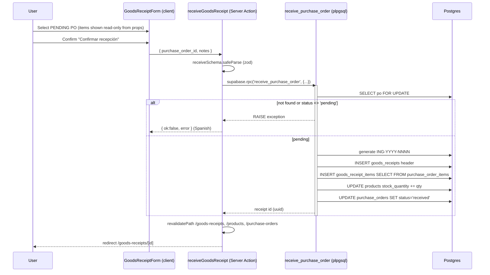

# Design: Ingreso de Mercadería (Module 4)

## Technical Approach

Mirror Module 3's feature-modular + RPC architecture. The receive operation runs as ONE Postgres function (`receive_purchase_order`, SECURITY INVOKER) so the receipt header/items, stock increment, and PO status flip are atomic — PostgREST cannot batch multi-statement transactions, so splitting these across a Server Action would risk stock/status drift on partial failure. The Server Action only re-validates with zod and calls `supabase.rpc(...)`. New additive migration `0003_goods_receipts.sql`. Reuses `public.set_updated_at()` and the `OC-`-style per-year code convention.

## Architecture Decisions

| Decision | Choice | Alternatives rejected | Rationale |
|----------|--------|-----------------------|-----------|
| Atomicity | Single plpgsql RPC | Server Action with sequential writes | Stock + status + receipt are inseparable; PostgREST has no multi-statement txn. |
| Double-receive guard | `SELECT ... FOR UPDATE` + `status <> 'pending'` raise, inside the same txn | App-level pre-check only | Row lock serializes concurrent receives; the status check is re-read under lock, so the loser raises instead of double-incrementing stock. UNIQUE on `purchase_order_id` is the DB backstop. |
| Show PO items in form | Server page passes all pending POs WITH their items as props; client renders the selected one's items from in-memory data | Extra fetch round-trip on select | Zero extra latency, no client Supabase call; demo-scale data is tiny. |
| Receipt code | `ING-YYYY-NNNN` from year + count+1, generated in RPC | Dedicated sequence object | Mirrors `OC-` convention; no extra DDL for 48h scope. |
| Security model | SECURITY INVOKER + authenticated RLS | SECURITY DEFINER | Caller's RLS already grants insert receipts/items + update products/POs; INVOKER keeps least-privilege. |
| Revalidation | `revalidatePath` on `/goods-receipts`, `/products`, `/purchase-orders` | Only `/goods-receipts` | Receive mutates stock and PO status, so those caches are stale too. |

## Data Flow / Sequence (receive)



## DB Migration (`supabase/migrations/0003_goods_receipts.sql`)

`goods_receipts`: `id uuid pk`, `code text UNIQUE NOT NULL`, `purchase_order_id uuid NOT NULL UNIQUE REFERENCES purchase_orders(id)`, `receipt_date date NOT NULL DEFAULT current_date`, `notes text`, `created_at/updated_at timestamptz DEFAULT now()`. RLS authenticated select/insert/update + `set_updated_at` trigger.

`goods_receipt_items`: `id uuid pk`, `goods_receipt_id uuid NOT NULL REFERENCES goods_receipts(id) ON DELETE CASCADE`, `product_id uuid NOT NULL REFERENCES products(id)`, `quantity int NOT NULL CHECK (quantity > 0)`, `created_at timestamptz DEFAULT now()`. RLS authenticated select/insert.

RPC `receive_purchase_order(p_purchase_order_id uuid, p_notes text) RETURNS uuid` — plpgsql, SECURITY INVOKER, GRANT EXECUTE TO authenticated. Body order: (1) `SELECT status INTO ... FROM purchase_orders WHERE id = p_purchase_order_id FOR UPDATE` → raise `'Orden de compra no encontrada'` if NULL, raise `'La orden no está pendiente'` if `status <> 'pending'` (this lock+check is the idempotency / double-stock guard). (2) build `ING-YYYY-NNNN` from `EXTRACT(YEAR FROM current_date)` + count+1. (3) INSERT header → `RETURNING id`. (4) `INSERT INTO goods_receipt_items (goods_receipt_id, product_id, quantity) SELECT v_id, product_id, quantity FROM purchase_order_items WHERE purchase_order_id = p_purchase_order_id`. (5) `UPDATE products p SET stock_quantity = stock_quantity + poi.quantity FROM purchase_order_items poi WHERE poi.purchase_order_id = p_purchase_order_id AND poi.product_id = p.id`. (6) `UPDATE purchase_orders SET status='received' WHERE id = p_purchase_order_id`. (7) `RETURN v_id`.

## File Changes

| File | Action | Description |
|------|--------|-------------|
| `supabase/migrations/0003_goods_receipts.sql` | Create | 2 tables + RLS + `receive_purchase_order` RPC |
| `src/features/goods-receipts/types.ts` | Create | `GoodsReceipt`, `GoodsReceiptItem`, joined detail/list views |
| `src/features/goods-receipts/schema.ts` | Create | `receiveSchema` (purchase_order_id uuid required, notes optional) |
| `src/features/goods-receipts/queries.ts` | Create | `listGoodsReceipts`, `getGoodsReceipt(id)`, `listPendingPurchaseOrders` (status='pending' + items) |
| `src/features/goods-receipts/actions.ts` | Create | `receiveGoodsReceipt` → rpc + Spanish error mapping |
| `src/features/goods-receipts/components/GoodsReceiptForm.tsx` | Create | client: PENDING-PO `<select>`, read-only items, notes, confirm |
| `src/features/goods-receipts/components/GoodsReceiptsTable.tsx` | Create | list table |
| `src/features/goods-receipts/components/GoodsReceiptDetail.tsx` | Create | detail view |
| `src/app/(app)/goods-receipts/page.tsx` | Create | list + "Nuevo ingreso" |
| `src/app/(app)/goods-receipts/new/page.tsx` | Create | server loads pending POs + items, renders form |
| `src/app/(app)/goods-receipts/[id]/page.tsx` | Create | detail; `await params`, `notFound()` |
| nav + dashboard | Modify | link "Ingreso de Mercadería" + dashboard card |
| `src/app/(app)/purchase-orders/[id]/page.tsx` | Modify (optional) | "Recibir mercadería" → `/goods-receipts/new?po=<id>` |

## Interfaces / Contracts

```ts
// schema.ts
export const receiveSchema = z.object({
  purchase_order_id: z.string().uuid(),
  notes: z.string().trim().max(500).optional(),
})

// actions.ts result
type ReceiveResult = { ok: true; id: string } | { ok: false; error: string }
```

Error mapping in `receiveGoodsReceipt` (mirrors Module 3 patterns): match `'no está pendiente'` → "La orden ya fue recibida o no está pendiente."; unique-violation (`23505`) → "Esta orden ya tiene un ingreso registrado."; else generic Spanish fallback. Queries use `data as unknown as Type` casts and `[goods-receipts]`-prefixed `console.error`.

## Testing Strategy

| Layer | What | Approach |
|-------|------|----------|
| Manual | Receive pending PO → stock +qty, status received, receipt persisted; re-receive raises | Live Supabase, SQL editor |
| Build | Type/route integrity | `npm run build` |
| Unit (deferred) | RPC guard, zod schema | Vitest — planned, NOT installed |

## Migration / Rollout

Additive only. Rollback: `DROP FUNCTION receive_purchase_order; DROP TABLE goods_receipt_items; DROP TABLE goods_receipts;`. No existing tables/columns altered.

## Open Questions

- None blocking. Partial/multi-receipt explicitly out of scope (proposal non-goal).
