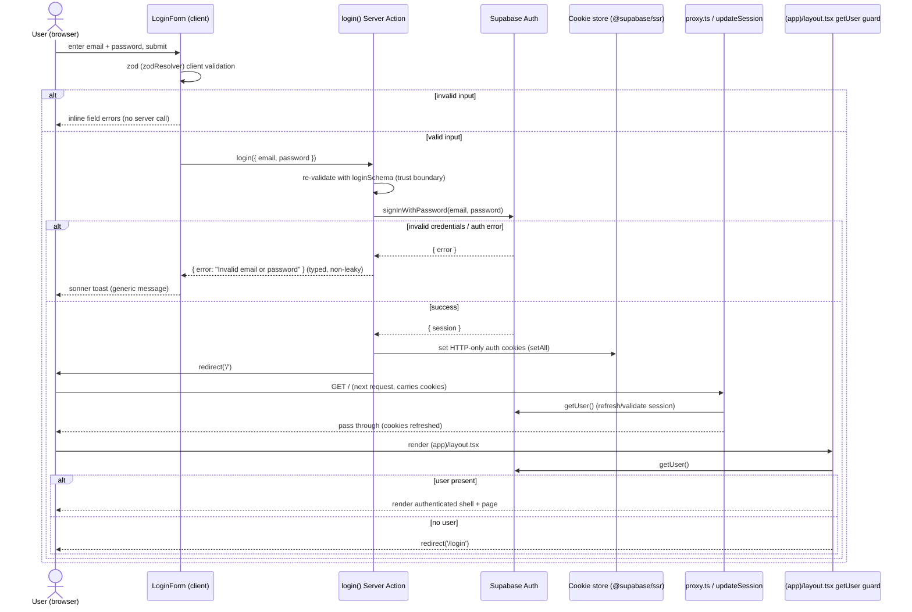
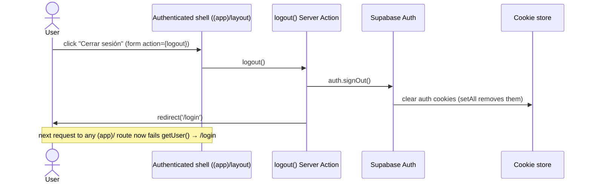

# Design: Login de usuarios (Supabase Auth)

Change: `login-supabase-auth` · Capability: `user-auth` · Project: `msvc-evaluacion-t1`

This design is the HOW at the architectural level. It builds on the existing Next.js 16
App Router + `@supabase/ssr` foundation and must not redesign it. Task breakdown lives in
the `tasks` phase.

---

## 1. Architecture Overview

### Chosen pattern

Feature-modular vertical slice under `src/features/auth/`, integrated with App Router via
route segments. The auth feature owns its UI, validation, and server mutations; the route
files are thin and delegate to the feature.

- **Mutations (login, logout)** → **Server Actions** in `src/features/auth/actions.ts`.
  Auth is a write to the session; it must run on the server where the `@supabase/ssr`
  server client can set HTTP-only cookies. There is no client-side credential handling.
- **Reads (current user / session for gating)** → server-side `getUser()` in the protected
  layout (Server Component). This is a server read on the request path, not client data
  fetching, so **TanStack Query is intentionally NOT used for the auth gate**. TanStack
  Query is the read layer for *later data modules* (Productos, OC) that fetch domain data
  in client components; auth gating happens before any of that renders. Noting this keeps
  the "Server Actions for mutations + TanStack Query for reads" convention coherent: the
  auth gate is a server render-time concern, not a client cache concern.

### Layering and boundaries

```
Route segment (thin)            Feature module (owns logic)        Infra (exists)
─────────────────────           ────────────────────────────       ──────────────────
app/(auth)/login/page.tsx  ───► features/auth/components/LoginForm  lib/supabase/client.ts
                                features/auth/actions.ts (login)     lib/supabase/server.ts
app/(app)/layout.tsx       ───► (calls server.ts getUser directly)  lib/supabase/middleware.ts
app/(app)/page.tsx              features/auth/actions.ts (logout)    proxy.ts
                                features/auth/schema.ts (zod)
```

Boundary rules:
- Route files import from the feature, never the reverse.
- The feature imports infra (`@/lib/supabase/*`), never route files.
- `LoginForm` is a Client Component; it invokes the `login` Server Action. It never touches
  the Supabase client directly — all auth I/O is server-side.

---

## 2. File / Module Layout

### Feature module — `src/features/auth/`

| File | Type | Responsibility |
|------|------|----------------|
| `schema.ts` | module | zod `loginSchema` (`email`: string email; `password`: min length). Exports `LoginInput` type inferred from the schema. Single source of truth for both client RHF validation and server re-validation. |
| `actions.ts` | `'use server'` | `login(input)` and `logout()` Server Actions. `login` re-validates with `loginSchema`, calls `supabase.auth.signInWithPassword`, returns a typed result on error, redirects on success. `logout` calls `supabase.auth.signOut` then redirects to `/login`. |
| `components/LoginForm.tsx` | `'use client'` | react-hook-form + `zodResolver(loginSchema)`; shadcn `Card`/`Input`/`Label`/`Button`; submits to the `login` action; renders inline field errors and fires a `sonner` toast on a returned auth error. |

> Optional helper (decide at task time, not required): a `LogoutButton.tsx` client
> component that calls the `logout` action via a form. Kept out of the table to avoid
> over-specifying; the authenticated shell can inline a `<form action={logout}>` button.

### Route segments — `src/app/`

| File | Type | Responsibility |
|------|------|----------------|
| `(auth)/login/page.tsx` | Server Component | Public route. Renders `<LoginForm />`. Optional: if `getUser()` already returns a user, redirect to `/` (avoid showing login to authenticated users). |
| `(app)/layout.tsx` | Server Component | **Protected layout / auth gate.** Calls `createClient()` then `supabase.auth.getUser()`. If no user → `redirect('/login')`. Otherwise renders the authenticated shell (header with user email + logout) around `{children}`. |
| `(app)/page.tsx` | Server Component | Minimal post-login landing ("authenticated shell"). Confirms login succeeded; placeholder for future modules. |

Route-group rationale: `(auth)` and `(app)` are pathless groups, so URLs stay `/login` and
`/`. The `(app)` group exists solely to attach the `getUser()` guard via its `layout.tsx`
to **every** route placed inside it — future modules (Productos, OC) drop into `(app)/` and
inherit protection for free. This is the key architectural lever: protection is structural,
not per-page.

### Modified — `src/proxy.ts` / `src/lib/supabase/middleware.ts`

`updateSession` already calls `getUser()` but currently only refreshes cookies. We add an
**unauthenticated-redirect block**: if there is no user AND the path is not public
(`/login`, auth assets), return a redirect to `/login` while preserving the refreshed
response cookies. Implementation detail belongs to tasks; the design decision is that the
redirect lives in `middleware.ts` (so `proxy.ts` stays a one-line entry point).

---

## 3. Sequence Diagram — Login Flow



---

## 4. Route Protection — Defense in Depth

Two independent layers guard protected routes. Both are required.

### Layer 1 — Middleware (`proxy.ts` → `updateSession`)
- Runs on **every** matched request (the existing matcher already excludes static assets).
- Refreshes the Supabase session cookies so Server Components see a valid session.
- **New responsibility:** if `getUser()` returns no user and the request is for a non-public
  path, redirect to `/login` *before* the route renders.
- Value: cheap, early, catches unauthenticated navigation cluster-wide; also keeps tokens
  fresh so the layer-2 check does not see a spuriously expired session.

### Layer 2 — Protected layout (`(app)/layout.tsx` `getUser()`)
- Runs at render time as a Server Component for anything under `(app)/`.
- Calls `getUser()` and `redirect('/login')` when absent.

### Why middleware alone is insufficient

`getUser()` in middleware revalidates against the Supabase Auth server, which is correct —
but relying on middleware as the *sole* gate is fragile:

1. **Matcher drift / config gaps.** Protection in middleware depends on a regex matcher. A
   future route, a matcher edit, or a Next.js edge-case in matching can silently expose a
   page. The layout guard is bound to the route tree itself (`(app)/`), so a page is
   protected by *where it lives*, not by a string pattern staying correct.
2. **Single point of failure.** One bug in the middleware redirect logic would unlock the
   whole app. Two layers means a defect in one is caught by the other.
3. **Render-time truth.** The layout guard runs in the exact server render that produces the
   protected HTML, eliminating any TOCTOU gap between the middleware decision and render.

The official Supabase + Next.js guidance is explicit: middleware refreshes the session, but
**`getUser()` must also be called in the server code that protects the page**. We follow
that posture. Layer 1 is the convenience/early-exit; Layer 2 is the authority.

> Note: client-only checks (e.g. reading session in a `useEffect`) are never a protection
> layer — they run after HTML ships and are trivially bypassed. All gating is server-side.

---

## 5. Logout Flow



`logout` is a Server Action invoked via a plain `<form action={logout}>` button in the
shell — no client JS required, works progressively. After `signOut`, cookies are cleared and
the next protected-route request is redirected by both guard layers.

---

## 6. First-Admin Provisioning — DECISION

**Decision: provision the first admin via a documented `supabase/seed.sql` script, with the
Supabase dashboard as the documented fallback.**

There is no public signup (out of scope), so a user must exist before the first login. Two
candidates were considered:

| Option | Pros | Cons |
|--------|------|------|
| **Dashboard-created user** | Zero code; immediate. | Manual, not reproducible, undocumented in repo, easy to forget on a fresh environment; not version-controlled. |
| **`supabase/seed.sql`** (chosen) | Reproducible, version-controlled, self-documenting, runs with `supabase db reset` / local dev; reviewers see exactly how the admin exists. | Requires the seed to insert into `auth.users` with a correctly hashed password (handled via `crypt()`/`gen_salt` in the seed) and a confirmed email. |

**Rationale:** the evaluation explicitly asks that first-user provisioning be *documented*
and reproducible. A committed `supabase/seed.sql` is the artifact that proves it and lets a
reviewer stand the project up deterministically. The seed inserts one confirmed admin
identity into `auth.users` (email confirmed so login is not blocked by an unverified-email
gate) with credentials documented in the README. The Supabase dashboard remains the
documented manual path for hosted environments where running the seed is impractical.

**Constraints captured for tasks:** the seed must set `email_confirmed_at` (or equivalent
confirmed state) so `signInWithPassword` succeeds, and must use Supabase's password hashing.
Credentials and the "change this in production" warning go in the README.

---

## 7. Error Handling

Typed, non-leaky, server-classified.

- **Client validation** (`zodResolver`): empty/malformed email, short password → inline field
  errors, no server round-trip. First defense, UX only — not a trust boundary.
- **Server re-validation**: `login` re-parses input with `loginSchema` before any Supabase
  call. The client is never trusted; this is the real validation boundary.
- **Auth result mapping**: `signInWithPassword` errors are caught and mapped to a small set
  of safe messages. Invalid credentials → a single generic **"Invalid email or password"**
  (never distinguish "user not found" vs "wrong password" — prevents user enumeration).
  Unexpected/network errors → **"Something went wrong. Please try again."**
- **Action return contract**: on error, `login` returns a typed object, e.g.
  `{ ok: false; error: string }`; on success it `redirect`s (no return). The client reads the
  error and fires a `sonner` toast. Raw Supabase error strings are **never** forwarded to the
  client.

```
signInWithPassword error
        │
        ▼
classify (invalid-credentials | other)
        │
        ▼
typed result { ok:false, error: <safe message> }  ──►  client  ──►  sonner toast
```

---

## 8. Environment Variables & Fail-Fast

Required (already referenced by the existing clients):

| Var | Used by |
|-----|---------|
| `NEXT_PUBLIC_SUPABASE_URL` | client.ts, server.ts, middleware.ts |
| `NEXT_PUBLIC_SUPABASE_ANON_KEY` | client.ts, server.ts, middleware.ts |

Today these are read with the non-null assertion (`!`), so a missing value fails late and
cryptically (e.g. an opaque fetch error at first auth call). **Decision:** add a small
fail-fast env accessor (validated once, e.g. a tiny module or zod parse of `process.env`)
that throws a clear, actionable message at startup/first import — "Missing
NEXT_PUBLIC_SUPABASE_URL" — instead of surfacing as a confusing runtime auth failure. This
directly mitigates the proposal's "Misconfigured Supabase env on Vercel" risk. An
`.env.example` documents the variables for local + Vercel setup.

---

## 9. Testing Approach (future)

Vitest is **planned but not yet installed** — noted as future work, not part of this change's
implementation:
- `schema.ts` → unit tests for `loginSchema` accept/reject cases (pure, highest ROI).
- `actions.ts` → tests with the Supabase client mocked: success redirects, auth error returns
  the typed safe message, server re-validation rejects bad input.
- Route guard → integration/e2e (Playwright, later) for the redirect-when-logged-out path.

No test tooling is added in this change; this section records intent so the tasks phase does
not silently assume coverage.

---

## 10. Architecture Decisions (ADR-style)

### ADR-1 — Auth gate is a server render concern, not TanStack Query
- **Decision:** gate via server-side `getUser()` in the protected layout; do not model the
  current user as a TanStack Query read.
- **Rationale:** gating must happen before protected HTML renders; TanStack Query is a
  client-side cache for domain reads. Using it for the gate would push the decision after
  hydration (bypassable, flicker). Convention "TanStack Query for reads" applies to later
  data modules, not the security boundary.
- **Rejected:** client-side session check / context provider as the gate — runs post-render,
  not a real boundary.

### ADR-2 — Defense in depth (middleware + layout) over middleware-only
- **Decision:** enforce in both `updateSession` (redirect) and `(app)/layout.tsx`
  (`getUser` redirect).
- **Rationale:** matcher drift and single-point-of-failure make middleware-only fragile;
  layout guard binds protection to the route tree. Matches official Supabase guidance.
- **Rejected:** middleware-only (fragile), layout-only (loses cheap early exit + cookie
  refresh ordering).

### ADR-3 — Route groups `(auth)` / `(app)` for structural protection
- **Decision:** place protected routes under `(app)/` so they inherit the layout guard;
  `/login` under `(auth)/`.
- **Rationale:** protection by location, not per-page wiring; future modules inherit it.
- **Rejected:** flat routes with per-page guards — repetitive, easy to forget on a new page.

### ADR-4 — First admin via committed `supabase/seed.sql`
- **Decision / Rationale / Rejected:** see §6.

### ADR-5 — Mutations as Server Actions; no client-side credential handling
- **Decision:** `login`/`logout` are Server Actions; cookies set server-side.
- **Rationale:** HTTP-only cookies require a server context; keeps secrets and credential
  flow off the client; aligns with the project's Server-Actions-for-mutations convention.
- **Rejected:** client-side `supabase.auth.signInWithPassword` — exposes session handling to
  the client and complicates SSR cookie sync.

### ADR-6 — Fail-fast env validation
- **Decision:** validate required Supabase env vars with a clear thrown error instead of bare
  `!` assertions.
- **Rationale:** turns a cryptic late failure into an actionable startup error; mitigates the
  Vercel misconfig risk.
- **Rejected:** keep `!` assertions — fails late and opaquely.

---

## 11. Integration Points & Data Flow Summary

- **Browser ↔ LoginForm:** RHF state, inline errors, toast surface.
- **LoginForm → `login` action:** serialized `{ email, password }` over the Server Action RPC.
- **`login`/`logout` → Supabase Auth:** via `@/lib/supabase/server.createClient()` (sets/clears
  cookies through `@supabase/ssr` `setAll`).
- **Every request → `proxy.ts` → `updateSession`:** refresh cookies + redirect-if-unauth.
- **Protected render → `(app)/layout.tsx`:** `getUser()` authority check.
- **Seed/dashboard → `auth.users`:** out-of-band provisioning, prerequisite to first login.

No new database tables, no migrations. The only DB artifact is the `seed.sql` admin insert.
```
