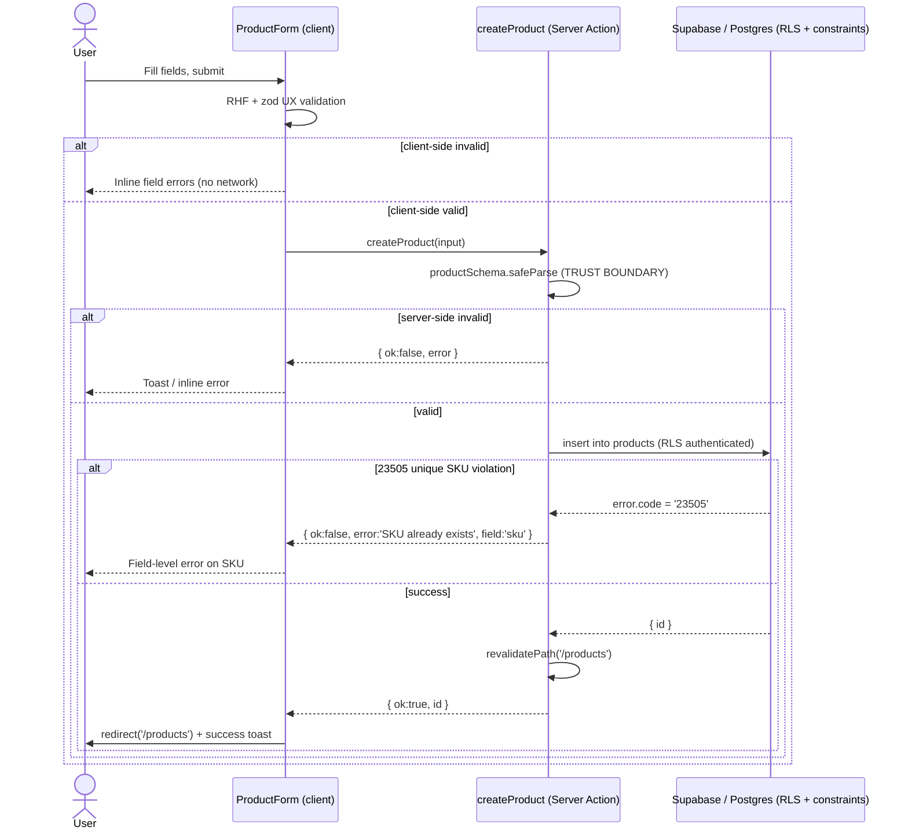

# Design: Maestro de Productos (Module 2)

> Architectural HOW for the `products-master` change. Builds on the existing
> Next.js 16 App Router + Supabase + shadcn/ui foundation. Reads from
> `proposal.md`. Does not redesign the auth or app-shell foundation.

## 1. Architecture Overview

### 1.1 Chosen pattern

Reuse the established **feature-modular layering** already proven by
`src/features/auth/`. Each feature owns its slice end-to-end:

```
src/features/products/
├── schema.ts        # zod productSchema — single source of validation truth
├── types.ts         # hand-written Product type (DB row shape)
├── actions.ts       # 'use server' mutations: create / update / toggleActive
├── queries.ts       # server reads: listProducts(search?), getProduct(id)
└── components/
    ├── product-form.tsx     # 'use client' RHF + zod form (create + edit)
    ├── products-table.tsx   # shadcn table renderer (server-fed rows)
    └── product-search.tsx   # 'use client' search input (URL-param driven)
```

Routes are thin composition shells under the existing `(app)` guard; they
import from the feature module and never embed business logic.

```
src/app/(app)/products/
├── page.tsx              # Server Component: list + search + "New" button
├── new/page.tsx          # Server Component shell -> <ProductForm mode="create">
└── [id]/edit/page.tsx    # Server Component: getProduct(id) -> <ProductForm mode="edit">
```

### 1.2 Layering and boundaries

| Layer | Responsibility | Trust |
|-------|----------------|-------|
| Route (Server Component) | Auth-guarded composition, SSR data fetch via `queries.ts`, pass server data down | Server, trusted |
| `queries.ts` | RLS-scoped reads through `createClient()` | Server, trusted |
| `actions.ts` (`'use server'`) | **Trust boundary** — re-validate with zod, perform mutation, map DB errors, revalidate cache | Server, trusted |
| `components/` (client) | UX-only validation, optimistic feedback, toast/inline errors | Client, **untrusted** |
| `schema.ts` | Shared validation contract used on both sides | — |

Key principle inherited from auth: **client validation is UX only; the Server
Action re-validates as the real trust boundary.** No mutation trusts client
input. RLS in Postgres is the final backstop.

### 1.3 Component / data-flow map

```
Browser (client component)
   │  form submit (RHF + zod UX validation)
   ▼
Server Action (actions.ts, 'use server')   ◄── TRUST BOUNDARY
   │  zod re-validate → supabase.insert/update (RLS authenticated)
   │  map 23505 → friendly error | revalidatePath('/products')
   ▼
Postgres (products table + RLS + CHECK constraints)   ◄── FINAL BACKSTOP

List path (no client roundtrip):
Route page.tsx (Server Component, auth-guarded)
   │  read searchParams
   ▼
queries.listProducts(search)  → supabase.select().ilike(...)
   ▼
<ProductsTable rows={...} />  (rendered server-side, streamed as HTML)
```

## 2. Architecture Decisions (ADR-style)

### ADR-1: Server Components for list reads, Server Actions for mutations (no TanStack Query)

**Decision.** The list and edit-prefill reads are **React Server Components**
calling `queries.ts` directly. Mutations are **Server Actions**. We do **not**
add TanStack Query in this iteration.

**Rationale.**
- The `(app)` layout already enforces auth server-side; reading in a Server
  Component keeps the auth + data fetch in one trusted pass with zero client
  bundle cost and native SSR.
- Search is the only interactive read, and it maps cleanly to URL search params
  (`?q=`), which Server Components re-render on navigation — no client cache
  needed.
- Server Actions + `revalidatePath('/products')` already give us correct
  cache invalidation after writes. Adding TanStack Query would duplicate the
  cache layer and introduce client/server state-sync complexity for no benefit
  at this scale.

**Rejected alternatives.**
- *TanStack Query + route handlers / client fetching.* Rejected: forces an
  extra API surface, ships query client to the browser, and re-implements auth
  context on the client. Justified only if the list later needs rich
  client-side interactivity (infinite scroll, optimistic reordering, polling).
- *Client-side fetch in `useEffect`.* Rejected: loses SSR, flashes empty state,
  and leaks the read pattern to an untrusted layer.

**Future trigger.** Reserve TanStack Query for if/when the table grows
client-driven features (debounced live filtering without navigation, optimistic
toggles, pagination prefetch). The feature-modular layout makes that an additive
swap inside `components/`, not a rewrite.

### ADR-2: Server-side search via `ilike` in `queries.ts`

**Decision.** Search filters server-side: `listProducts(search?)` applies
`.or('name.ilike.%q%,sku.ilike.%q%')` (or two chained `ilike`) in the Supabase
query.

**Rationale.**
- Correct and scalable: filtering happens in Postgres against the indexed table,
  not by shipping the full catalog to the browser.
- RLS still applies to the filtered query — no data leaves the server
  unfiltered.
- Drives the URL search param model from ADR-1; bookmarkable/shareable search.

**Rejected alternative.** *Client-side filter on a fully-loaded array.* Rejected:
downloads the entire (potentially large) catalog, breaks once pagination is
added, and offers no security benefit. Acceptable only for tiny static lists,
which this is not.

**Note.** Case-insensitivity comes from `ilike`. A trigram/GIN index is a future
optimization, not needed at brief scale.

### ADR-3: Soft delete only (`is_active` toggle), no DELETE policy

**Decision.** No hard delete. `toggleProductActive` flips `is_active`. The RLS
policy set intentionally omits a DELETE policy.

**Rationale.** Downstream modules (Orden de Compra, Ingreso de Mercadería) will
FK-reference products. Deleting a referenced product breaks referential
integrity and history. Omitting the DELETE policy makes hard delete impossible
even via direct API — defense in depth at the database layer.

**Rejected alternative.** *Hard delete with `ON DELETE RESTRICT`.* Rejected:
still loses historical product data and complicates reporting; soft delete is
strictly safer for a master entity.

### ADR-4: Map Postgres `23505` to a friendly field error in the Server Action

**Decision.** On unique-violation (`error.code === '23505'`) from the SKU unique
constraint, `createProduct`/`updateProduct` return
`{ ok: false, error: 'A product with this SKU already exists.' }` targeted at the
`sku` field, instead of leaking the raw constraint message.

**Rationale.** Mirrors the auth pattern of never forwarding raw DB/auth errors to
the client. Gives the form a precise, actionable, field-level message.

**Rejected alternative.** *Pre-check with a SELECT before insert.* Rejected:
race-prone (TOCTOU) and an extra roundtrip; the DB unique constraint is the
authoritative guard, so we react to its error code instead of pre-checking.

### ADR-5: Hand-written `Product` type now; Supabase generated types later

**Decision.** Define `Product` by hand in `src/features/products/types.ts`
matching the table row.

**Rationale.** Zero tooling/setup, immediate, and the table is small and stable.
Avoids a codegen step in a 48h window.

**Rejected alternative / future improvement.** *`supabase gen types typescript`.*
Deferred: better long-term (types track the schema automatically) but adds a
generation step and CI wiring not justified yet. Note it in README as a future
improvement.

### ADR-6: Single `ProductForm` for create and edit (`mode` prop)

**Decision.** One client form component drives both create and edit via a
`mode: 'create' | 'edit'` prop and optional `initialValues`. It calls the
matching Server Action and shows inline (RHF) + toast (sonner) feedback.

**Rationale.** Create and edit share the same field set and validation; one
component avoids divergence and duplicated zod wiring. Matches the established
RHF + zod + toast UX from auth.

## 3. Database Migration Design — `supabase/migrations/0001_products.sql`

Additive only. Creates the table, constraints, `updated_at` trigger, and
authenticated-only RLS policies (no DELETE policy).

```sql
-- ============================================================
-- Migration: 0001_products
-- Description: products master table — unique SKU, money/stock CHECKs,
--              updated_at trigger, authenticated-only RLS (no hard delete).
-- Apply via: Supabase SQL editor or `supabase db push`
-- ============================================================

-- 1. Table -----------------------------------------------------
create table if not exists public.products (
  id              uuid primary key default gen_random_uuid(),
  sku             text not null unique,
  name            text not null,
  description     text,
  unit_price      numeric(12, 2) not null check (unit_price >= 0),
  stock_quantity  integer not null default 0 check (stock_quantity >= 0),
  unit_of_measure text,
  category        text,
  is_active       boolean not null default true,
  created_at      timestamptz not null default now(),
  updated_at      timestamptz not null default now()
);

-- Helpful index for soft-delete-aware listing/search.
create index if not exists products_is_active_idx on public.products (is_active);

-- 2. updated_at trigger ---------------------------------------
-- Supabase ships the `moddatetime` extension; prefer it for less custom code.
create extension if not exists moddatetime schema extensions;

create trigger products_set_updated_at
  before update on public.products
  for each row
  execute function extensions.moddatetime(updated_at);

-- 3. Row Level Security ---------------------------------------
alter table public.products enable row level security;

-- Read: any authenticated user.
create policy "products_select_authenticated"
  on public.products for select
  to authenticated
  using (true);

-- Insert: any authenticated user.
create policy "products_insert_authenticated"
  on public.products for insert
  to authenticated
  with check (true);

-- Update: any authenticated user (covers soft-delete toggle).
create policy "products_update_authenticated"
  on public.products for update
  to authenticated
  using (true)
  with check (true);

-- NOTE: No DELETE policy — hard delete is intentionally impossible.
--       Disable products via is_active toggle instead.
```

**Notes.**
- `moddatetime` is the standard Supabase approach; if the extension is
  unavailable in the target project, fall back to a custom
  `set_updated_at()` `plpgsql` function returning `NEW` with
  `NEW.updated_at = now()`. The design prefers `moddatetime` for less custom SQL.
- CHECK constraints (`unit_price >= 0`, `stock_quantity >= 0`) are the DB-level
  half of the defense-in-depth pair (zod is the other half).
- The unique constraint on `sku` is what raises `23505`, consumed by ADR-4.

## 4. Feature Module Contracts

### 4.1 `schema.ts`
```ts
export const productSchema = z.object({
  sku: z.string().trim().min(1, 'SKU is required.').max(64),
  name: z.string().trim().min(1, 'Name is required.').max(200),
  description: z.string().trim().max(2000).optional().or(z.literal('')),
  unit_price: z.coerce.number().nonnegative('Price cannot be negative.'),
  stock_quantity: z.coerce
    .number()
    .int('Stock must be a whole number.')
    .nonnegative('Stock cannot be negative.'),
  unit_of_measure: z.string().trim().max(20).optional().or(z.literal('')),
  category: z.string().trim().max(100).optional().or(z.literal('')),
})
export type ProductInput = z.infer<typeof productSchema>
```
`z.coerce.number()` handles HTML inputs delivering strings. Used by both the
client form (UX) and the Server Action (trust boundary).

### 4.2 `types.ts`
```ts
export type Product = {
  id: string
  sku: string
  name: string
  description: string | null
  unit_price: number
  stock_quantity: number
  unit_of_measure: string | null
  category: string | null
  is_active: boolean
  created_at: string
  updated_at: string
}
```

### 4.3 `actions.ts` (`'use server'`) — mutation contracts
Result shape mirrors the auth feature's `{ ok: false; error }` convention,
extended with success and a field hint:
```ts
type ActionResult =
  | { ok: true; id: string }
  | { ok: false; error: string; field?: 'sku' }

createProduct(input: ProductInput): Promise<ActionResult>
updateProduct(id: string, input: ProductInput): Promise<ActionResult>
toggleProductActive(id: string, isActive: boolean): Promise<ActionResult>
```
Each: re-validate with `productSchema.safeParse`; `createClient()`; perform
insert/update; on `error.code === '23505'` return
`{ ok: false, error: 'A product with this SKU already exists.', field: 'sku' }`;
log raw error server-side only; on success `revalidatePath('/products')` and
return `{ ok: true, id }`. Create/edit routes redirect after a successful
action (redirect lives in the route/component, consistent with auth).

### 4.4 `queries.ts` — read contracts
```ts
listProducts(search?: string): Promise<Product[]>   // ilike name/sku when search set
getProduct(id: string): Promise<Product | null>     // edit prefill
```
Reads go through `createClient()` so RLS applies. `listProducts` orders by
`name`; search applies `.or('name.ilike.%q%,sku.ilike.%q%')`.

## 5. Sequence Diagram — Create Product



The edit flow is identical except `updateProduct(id, input)` issues an UPDATE
and the `updated_at` trigger fires; `23505` handling is the same when the SKU is
changed to a colliding value.

## 6. Error Handling & Revalidation

- **Validation:** zod on client (UX) and server (authoritative). Negative
  price/stock blocked pre-submit and by DB CHECK.
- **Unique SKU:** `23505` → friendly field error (ADR-4). Never leak raw SQL.
- **Unexpected errors:** logged server-side (`console.error('[products] ...')`),
  client receives a generic message — same discipline as auth.
- **Cache:** every successful mutation calls `revalidatePath('/products')` so the
  list reflects changes immediately. Edit success also revalidates the list;
  redirect happens at the route/component layer.

## 7. Testing Approach (planned)

Vitest is **planned but not installed** in this iteration. Target coverage once
added:
- Unit: `productSchema` accepts valid input, rejects negative price/stock and
  empty SKU/name.
- Unit: `actions` map `23505` to the friendly `field:'sku'` error and call
  `revalidatePath` on success (Supabase client mocked).
- Integration (future): RLS denies anon access; soft-delete toggle hides from
  default list. These map directly to the proposal's Success Criteria.

## 8. Traceability to Success Criteria

| Success Criterion | Design element |
|-------------------|----------------|
| New product persists & appears in list | `createProduct` + `revalidatePath` + `listProducts` (ADR-1) |
| Editing updates values | `updateProduct` + `updated_at` trigger |
| Duplicate SKU → field error | unique constraint + ADR-4 `23505` mapping |
| Negative price/stock rejected (pre + DB) | zod `nonnegative` + CHECK constraints |
| Disabling hides without deleting | `toggleProductActive` + no DELETE policy (ADR-3) |
| Anon access denied | RLS enabled, policies scoped `to authenticated` |
