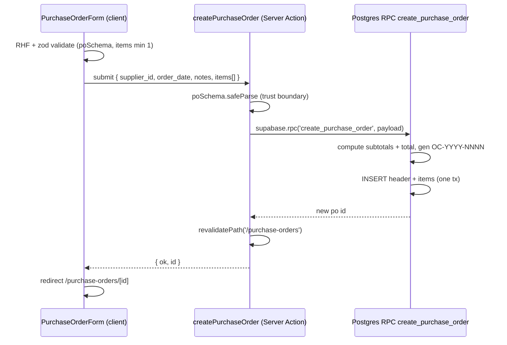

# Design: Orden de Compra (Module 3)

## Technical Approach

Two new feature modules (`suppliers`, `purchase-orders`) under the existing
`src/features/<module>/` pattern (`types.ts`, `schema.ts`, `queries.ts`,
`actions.ts`, `components/`). Reads via the Supabase server client; mutations via
Server Actions. PO creation is delegated to a single Postgres RPC
`create_purchase_order(...)` (plpgsql, SECURITY INVOKER) so the header, all items,
the total, and the code are written in ONE transaction under RLS. The product
picker reuses `products.listProducts(undefined, false)` (active only).

## Architecture Decisions

| Decision | Choice | Alternatives rejected | Rationale |
|----------|--------|-----------------------|-----------|
| Atomicity | RPC `create_purchase_order` does header+items+total in one tx | JS "insert header then insert items" | PostgREST has no multi-statement tx; the naive path can leave orphan headers on partial failure. RPC is the only correct option. |
| PO code | Generated INSIDE the RPC: `OC-YYYY-NNNN` from per-year count+1, `code UNIQUE` as backstop | Action-side count (race + extra round-trip); dedicated sequence/year-table | Single tx already holds the row lock; counting inside the tx is atomic. Sequence adds an object + per-year reset complexity not worth it for a single-user demo. UNIQUE surfaces any collision. |
| Totals | Computed in RPC (`sum(quantity*unit_cost)`), stored on header | DB trigger; client-sent total | PO is immutable post-create → no drift. Computing server-side prevents tampering; no trigger complexity. |
| Migration file | Single `0002_purchase_orders.sql` (suppliers + PO + items + RPC) | Two files (`0002_suppliers`, `0003_purchase_orders`) | All three tables + RPC ship together as one atomic feature; one ordered file is simpler to apply on live Supabase. (Deviates from proposal's 2-file note — consolidated.) |
| Suppliers module | Separate `src/features/suppliers/` (schema, `createSupplier`, `listSuppliers`) | Inline inside purchase-orders | Clean separation; Module 4+ may reuse suppliers. Kept minimal (no edit/delete). |
| Dropdown UI | Native `<select>` styled with Tailwind | `npx shadcn add select` | No shadcn select installed; native select is dependency-free, accessible, sufficient for supplier + product pickers. |
| Items delete policy | `ON DELETE CASCADE` from header; no item-level delete policy | Explicit item delete RLS | POs are never hard-deleted; items only inserted at PO creation. Cascade covers the theoretical drop; no UI deletes items. |

## Data Flow — PO Creation (sequence)



## File Changes

| File | Action | Description |
|------|--------|-------------|
| `supabase/migrations/0002_purchase_orders.sql` | Create | suppliers + purchase_orders + purchase_order_items + RLS + seed + RPC |
| `src/features/suppliers/{types,schema,queries,actions}.ts` | Create | minimal supplier read/create |
| `src/features/suppliers/components/{supplier-form,suppliers-table}.tsx` | Create | minimal list + create |
| `src/features/purchase-orders/{types,schema,queries,actions}.ts` | Create | PO domain |
| `src/features/purchase-orders/components/{purchase-order-form,purchase-orders-table,purchase-order-detail}.tsx` | Create | form (useFieldArray), list, detail |
| `src/app/(app)/suppliers/page.tsx` | Create | list + inline create |
| `src/app/(app)/purchase-orders/{page,new/page,[id]/page}.tsx` | Create | list, form, detail (async params) |

## Interfaces / Contracts

```sql
-- Migration 0002 (abridged — full SQL written during apply)
-- suppliers: id uuid pk, name text not null, tax_id, email, phone,
--   is_active bool default true, created_at, updated_at + set_updated_at trigger + seed rows
-- purchase_orders: id, code text unique not null, supplier_id -> suppliers,
--   order_date date default current_date, status text default 'pending'
--   check status in ('pending','received','cancelled'), notes,
--   total numeric(12,2) default 0 check >=0, timestamps + trigger
-- purchase_order_items: id, purchase_order_id -> purchase_orders on delete cascade,
--   product_id -> products, quantity int check >0, unit_cost numeric(12,2) check >=0,
--   subtotal numeric(12,2) check >=0, created_at
-- RLS: select/insert/update TO authenticated USING(true) on all 3 (items: select+insert)

CREATE FUNCTION public.create_purchase_order(
  p_supplier_id uuid,
  p_order_date  date,
  p_notes       text,
  p_items       jsonb   -- [{product_id, quantity, unit_cost}]
) RETURNS uuid
LANGUAGE plpgsql SECURITY INVOKER AS $$
-- compute subtotal per item + total, gen code OC-YYYY-NNNN,
-- INSERT header then items, RETURN new id (single tx)
$$;
```

```typescript
// purchase-orders/schema.ts (zod)
poItemSchema: { product_id: uuid, quantity: int>0, unit_cost: number>=0 }
poSchema: { supplier_id: uuid, order_date: date, notes?: string,
            items: poItemSchema[] (min 1) }
// queries.ts: listPurchaseOrders() (supplier join),
//   getPurchaseOrder(id) (items+product+supplier joins), listSuppliers()
// actions.ts: createPurchaseOrder (rpc), cancelPurchaseOrder(id) (pending-only guard)
```

**Trickiest UI**: `PurchaseOrderForm` line-items editor uses
`react-hook-form` `useFieldArray` (add/remove rows; each row = product picker +
qty + unit_cost) with live per-row subtotal and a running total computed from
`watch()`. Mirror the existing union-string/number zod transform pattern.

## Testing Strategy

| Layer | What to Test | Approach |
|-------|-------------|----------|
| Unit | `poSchema` (min 1 item, qty>0, cost>=0) | Vitest (planned, not installed) |
| Integration | RPC atomicity + code uniqueness | manual / future Supabase test |
| E2E | create PO → detail | manual for 48h scope |

## Migration / Rollout

Additive only. Rollback: `DROP FUNCTION create_purchase_order; DROP TABLE
purchase_order_items, purchase_orders, suppliers;`. No existing tables altered.

## Open Questions

- [ ] None blocking. Vitest deferred (config rule); Next 16 async
  `params`/`searchParams` must be awaited in all new route pages.
